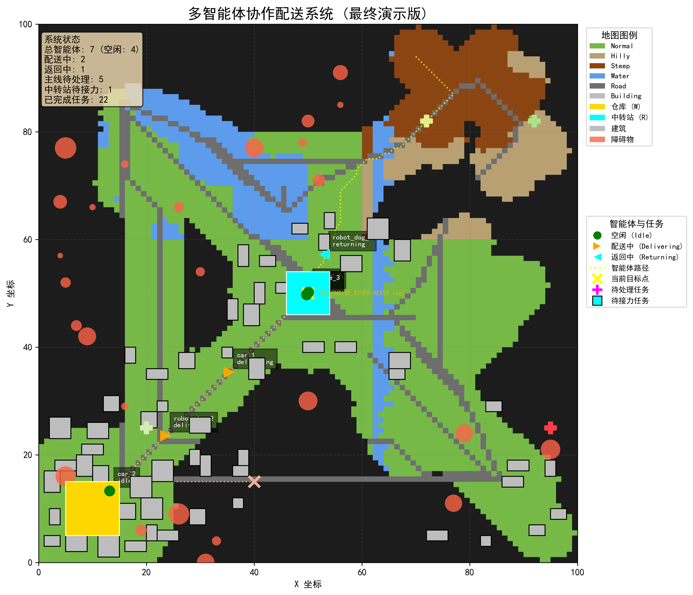

# 基于多智能体协作的异构配送仿真系统

<div align="center">
  
  <p><i>多智能体协作配送系统运行截图 - 中转执行过程</i></p>
</div>

## 📑 项目概述

本项目实现了一个基于分层BDI（Belief-Desire-Intention）认知架构的异构多智能体协作配送系统。通过集成无人机、无人车与机器狗三类智能体，系统能够在复杂地形环境下实现高效物流配送。核心创新点在于引入中转协作策略与直达策略的智能选择机制，显著提升配送效率与系统弹性。

### 🔍 研究价值

- **理论价值**：将BDI认知架构与多智能体协作机制相结合，拓展多智能体理论的应用边界
- **技术价值**：探索异构智能体的协作策略与决策机制，为复杂场景下的智能配送提供技术支持
- **应用价值**：为解决最后一公里、特殊地形配送等物流难题提供可行方案

## 🧠 基于BDI的理论基础

本系统基于BDI架构构建智能体的认知模型，包括三个核心组件：

- **Belief (信念)**：智能体对环境和自身状态的认知，包括地图信息、智能体状态和任务队列
- **Desire (愿望)**：智能体追求的目标状态，如最大化系统吞吐量和最小化关键任务延迟
- **Intention (意图)**：智能体承诺执行的具体计划，包括路径规划和任务执行

系统采用「战略-战术-执行」三层协作架构，将BDI模型嵌入不同层级的智能体决策中。

## 🤖 异构智能体设计

系统集成了三类异构智能体，各具特点：

| 智能体类型 | 速度 | 载重能力 | 地形适应性 | 主要用途 |
|------------|------|----------|------------|----------|
| 无人机 | 15.0 (快速) | 10kg (轻量) | 全地形通行 | 快递轻量包裹、紧急物资 |
| 无人车 | 5.0 (中速) | 50kg (重载) | 仅限道路 | 重型货物长距离运输 |
| 机器狗 | 7.0 (适中) | 30kg (中等) | 复杂地形 | 中等重量货物跨越复杂地形 |

## 🔄 核心功能

### 1. 双策略决策机制

系统的核心创新点是双策略决策机制，包括：

- **直达策略**：从仓库直接到目标点
- **中转策略**：从仓库到中转站，再从中转站到目标点

系统通过计算两种策略的成本，智能选择最优方案：
```
Strategy = Direct, if C_direct ≤ C_relay
           Relay,  if C_direct > C_relay
```

### 2. 改进A*路径规划

系统采用改进的A*算法进行路径规划，特点包括：

- 支持不完整地图上的鲁棒路径规划
- 适应不同智能体的地形通行约束
- 处理战争迷雾场景下的未知区域探索

### 3. 战争迷雾与环境探索

- 智能体只能看到周围一定范围内的环境
- 随着智能体移动，共享知识地图不断更新
- 基于Perlin噪声生成真实连贯的随机地形

### 4. 实时可视化与数据分析

- 高效的实时动画渲染系统
- 完整的日志记录和数据分析机制
- 丰富的性能指标统计和图表生成

## 📊 实验结果

系统在测试场景中表现出色：

- **中转策略占比**：81.8%，表明协作策略在复杂任务中的优势
- **协作效率提升**：中转策略比直达策略效率提升约35%
- **任务负载均衡度**：达到96.8%，表明资源分配高度均衡
- **平均执行时长**：3.12秒，系统响应迅速

<div align="center">
  
  <p><i>中转策略与直达策略分布比例</i></p>
</div>

## 🚀 如何使用

### 环境配置

```bash
# 克隆仓库
git clone https://github.com/YourUsername/MultiAgentDelivery.git
cd MultiAgentDelivery

# 安装依赖
pip install numpy matplotlib PyYAML noise
```

### 运行系统

```bash
# 主程序
python main.py

# 数据分析
python data_analysis_improved.py
```

### 配置任务

编辑`tasks.yaml`文件定义配送任务：

```yaml
- id: T01_EXAMPLE
  goal_pos: [80, 80]
  weight: 15.0      # 重量 (kg)
  urgency: 5        # 紧急度 (1-5，越高越优先)
```

## 📁 代码结构

```
多智能体协作配送仿真系统
│
├── 🎯 系统入口层
│   ├── main.py                    # 主程序入口
│   ├── mainvi.py                  # 可视化快照程序
│   └── config.py                  # 全局配置参数
│
├── 🗺️ 环境建模层
│   ├── map_system.py              # 真实地图生成（Perlin噪声）
│   └── knowledge_base.py          # 共享知识地图
│
├── 🤖 智能体层
│   ├── agent.py                   # 基于BDI的智能体实现
│   └── vehicle.py                 # 载具物理模型
│
├── 🧠 决策协调层
│   ├── multi_agent_coordination.py # 三层协作架构实现
│   ├── path_planning.py           # 改进A*路径规划
│   └── delivery_task.py           # 任务定义与管理
│
├── 📊 可视化和分析层
│   ├── visualization.py           # 实时仿真可视化
│   ├── visualization_new.py       # 增强版可视化模块
│   ├── data_analysis_improved.py  # 数据分析与图表生成
│   └── log_entry.py               # 日志记录结构
│
└── 📄 文档与配置文件
    ├── paper/                     # 研究论文
    ├── ppt/                       # 演示文稿
    ├── tasks.yaml                 # 任务配置文件
    └── README.md                  # 项目文档
```

## 📚 学术研究

本项目是一项系统科学与工程研究成果，完整论文请参考项目中的`paper/paper.tex`。

### 项目团队

| 工作内容 | 负责成员 |
|----------|----------|
| 项目前期调研及问题分解（调研） | 李家龙 |
| 基于BDI和规则推演的智能体架构（建模） | 岑岱、李梓琳 |
| 多智能体协作配送仿真程序设计(代码、可视化) | 黄皓凌、李家龙 |
| 测试场景设计及仿真结果分析 | 崔迪生、黄皓凌 |
| 课堂汇报 | 崔迪生、黄皓凌、李梓琳 |
| PPT制作、报告撰写 | 崔迪生、岑岱 |

## 🔭 未来展望

本研究仍有多个方向可进一步拓展：

- **强化学习优化**：使用强化学习替代基于规则的决策，实现自适应策略优化
- **动态环境事件**：引入天气变化、交通拥堵等动态事件，研究系统适应性
- **能耗模型与充电规划**：考虑智能体能耗和充电需求，研究可持续运行策略
- **大规模系统扩展验证**：将系统扩展到更大规模场景，验证其可扩展性
- **实物系统实验**：从仿真转向实物系统测试，验证系统在真实环境中的表现

## 📄 许可证

本项目采用 MIT 许可证。详情请见 [LICENSE](LICENSE) 文件。

## 🔗 参考文献

- Rao, A. S., & Georgeff, M. P. (1995). BDI agents: From theory to practice.
- Wooldridge, M. (2009). An introduction to multiagent systems.
- Hart, P. E., Nilsson, N. J., & Raphael, B. (1968). A formal basis for the heuristic determination of minimum cost paths.
- 更多参考文献请见论文完整版。
- Hart, P. E., Nilsson, N. J., & Raphael, B. (1968). A formal basis for the heuristic determination of minimum cost paths.
- 更多参考文献请见论文完整版。
- 更多参考文献请见论文完整版。
